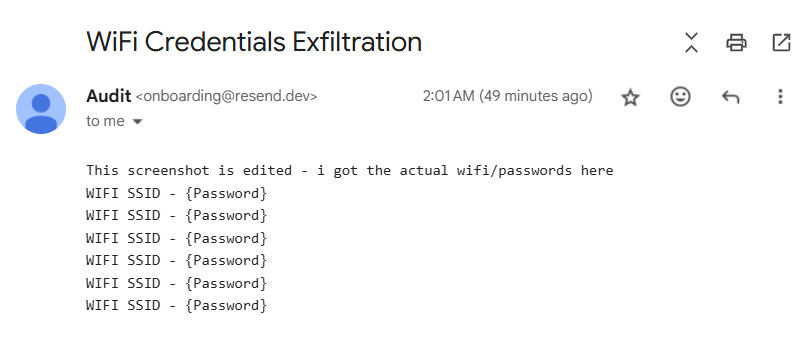
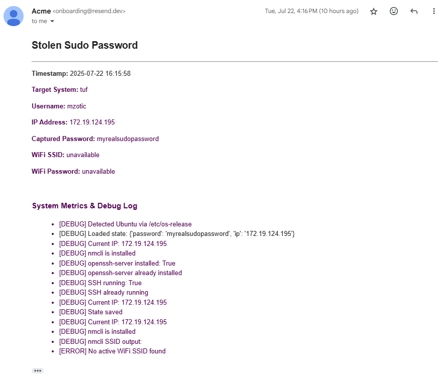

# sudosteal
A collection of Bash and Python scripts executed through main RubberDucky scripts

## RubberDucky Script Flows

### 1. `test.txt` (Demo/Test Script)
- **Purpose:** Simple test to showcase that the RubberDucky setup is working.
- **Flow:**
  - Opens a terminal on the target machine.
  - Downloads and executes a harmless test Bash script (`scripts/test.sh`) from this repository.
  - Demonstrates the ability to run scripts via RubberDucky.

### 2. `windows.txt` (WiFi Password Exfiltration)
- **Purpose:** Steals all saved WiFi SSIDs and passwords from a Windows machine and emails them to you.
- **Flow:**
  - Opens the Run dialog (`Win + R`) and launches PowerShell.
  - Sets PowerShell execution policy and runs a remote payload script (`scripts/windows_payload.ps1`).
  - The script extracts all saved WiFi SSIDs and their passwords.
  - Sends the credentials to your email using the Resend API.
  - All actions are performed silently and complete in under 5 seconds, with no visible trace left for the user.
- **Email:**
Heres how the resend.dev email looks like for the windows payload

### 3. `ubuntu.txt` (Advanced Credential & Access Exfiltration)
- **Purpose:** Most advanced script; captures sudo password, exfiltrates credentials, and sets up persistent access.
- **Flow:**
  - Opens a terminal on the target Ubuntu machine.
  - Downloads and executes a payload script (`scripts/ubuntu_payload.sh`).
  - The payload script:
    - Checks if the credential log exists. If not, downloads the main Python payload and schedules it to run in 20 minutes via a cron job.
    - The Python payload (`src/payload.py`) launches a fake terminal update prompt, asking for the sudo password in a realistic manner.
    - Captures the sudo password and current IP address, then emails them to you (along with WiFi info if available) using the Resend API.
    - Installs and enables SSH server for remote access if not already present, using the captured sudo password.
    - All actions are designed to appear as a normal system update, minimizing user suspicion.
- **Email:**
Heres how the resend.dev email looks like for the ubuntu payload

---

**Note:**
- Before using, replace the placeholders `<PUT-YOUR-RESEND-API-KEY>` and `<PUT YOUR EMAIL HERE>` in the `.txt` scripts with your actual Resend API key and email address.
- These scripts are intended solely for educational purposes and/or authorized security testing. The author does not take any liability for misuse, damage, or legal consequences arising from their use.
